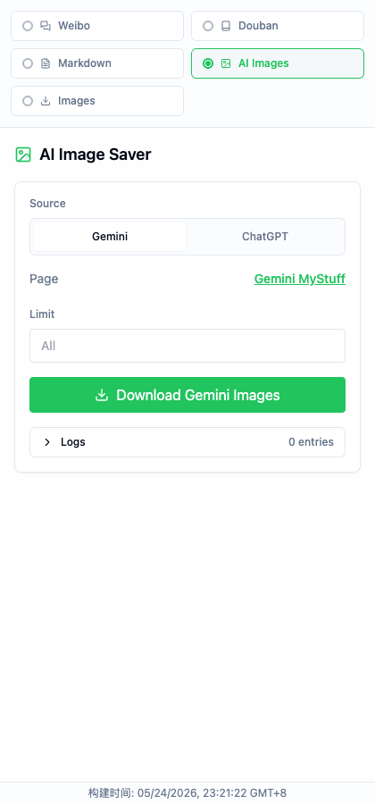
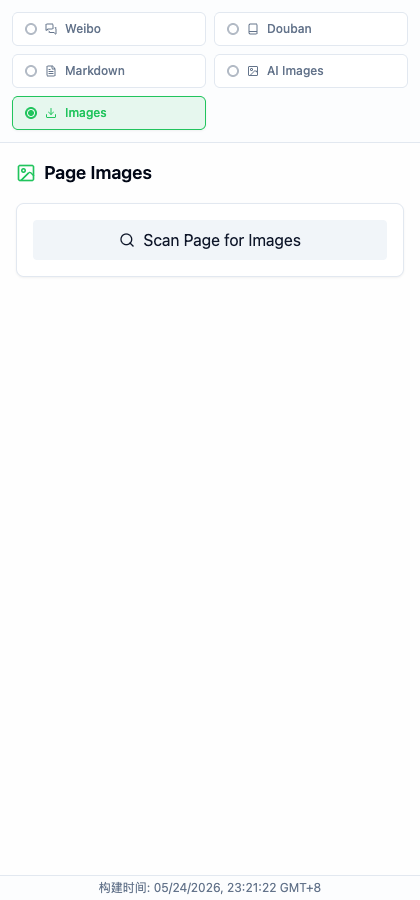
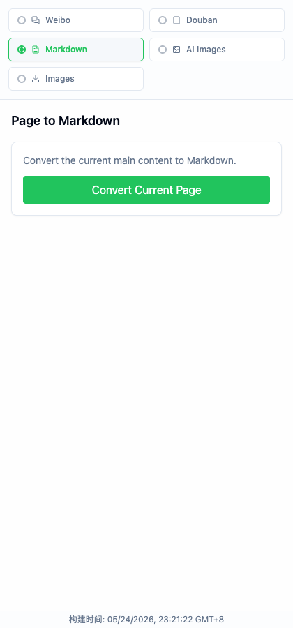

# Scrape to Markdown Chrome Extension


A Chrome side-panel extension for saving web content as Markdown, exporting social reading data, and downloading images from AI tools or regular webpages.

一个 Chrome 侧边栏扩展，用于网页转 Markdown、社交内容导出，以及批量下载 AI 图片和网页图片。


## Screenshots

### AI Image Saver

Download original images from Gemini MyStuff and ChatGPT Images, with an optional max-image limit, task summary, and expandable progress logs.



### Page Images

Scan the current webpage and batch download images with dimension filtering.



### Markdown Export

Convert the current page's readable article content into Markdown.



## Features

| Feature | What it does |
| --- | --- |
| AI Image Saver | Downloads original images from Gemini MyStuff and ChatGPT Images into ZIP files. |
| Page Images | Scans any webpage for images and downloads selected images in bulk. |
| Page to Markdown | Uses Readability and Turndown to convert article-like webpages to clean Markdown. |
| Weibo Scraper | Collects Weibo profile posts with filtering and JSON/Markdown export. |
| Douban Export | Exports Douban book/movie collections and wishes with sequential task support. |
| Smart Initial Tab | Opens the most relevant panel based on the active page, or falls back to Images. |
| Build Timestamp | Shows the build time in the footer so you can tell whether Chrome loaded the latest build. |

## Install From Release

1. Download the latest ZIP from [Releases](https://github.com/holynova/scrape-to-markdown.chrome/releases).
2. Unzip it.
3. Open `chrome://extensions/`.
4. Enable Developer Mode.
5. Click `Load unpacked` and select the unzipped extension folder.

## Build From Source

```bash
git clone https://github.com/holynova/scrape-to-markdown.chrome.git
cd scrape-to-markdown.chrome
npm install
npm run build
```

Then load the generated `dist` folder in `chrome://extensions/`.

## Development

```bash
npm install
npm run dev
npm run build
npm run lint
```

The side panel shows a build timestamp at the bottom. After rebuilding, reload the unpacked extension in Chrome and compare that timestamp to confirm Chrome is using the newest build.

## Tech Stack

- React 19 + TypeScript
- Vite + `@crxjs/vite-plugin`
- Tailwind CSS
- JSZip
- `@mozilla/readability`
- Turndown

## Notes

- ChatGPT image downloads use the current browser login session and ChatGPT's image library API. If the API shape changes, extraction may need an update.
- Gemini image downloads transform image URLs to request full-resolution assets.
- ZIP files store already-compressed images without recompressing them, which keeps packaging faster.